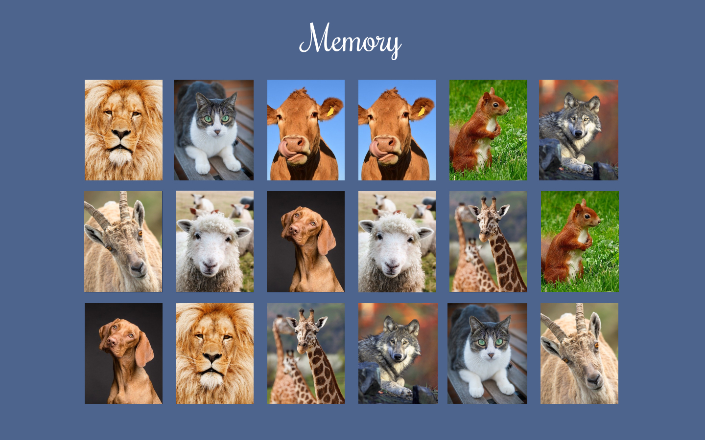

# [Memory](https://memory-francisco.netlify.app/)

## Overview

The Memory game. There are several cards and the player must find each card's pair by turning them over two at a time. 

## Details

- This project is intended to be a practice project. The goal is to make the game with my own code, not looking at other memory games made with JS. 
- The intended users are mainly my classmates and whoever wants to play it.
- The required content for this project are images. All images were obtained from https://www.pixabay.com. 

## Wireframes

## Time

- Estimated: 5 hours over 1 week
- Actual: 6 hours over 2 days

## New skills

A better use of the DOM and JS. For this project I tried to make each step in a different function, to make the code clearer. It was much harder than I expected, but I'm looking forward to find a better way to do it.

## Challenges + Lessons Learned

The main challenge here was how to let the computer know when two images where the same. I had to learn a lot about DOM to get this right. 

Another very useful thing that I learned was the setTimeout function. It's very useful to execute a certain amount of function at a given time. 

## Achievements
Patience.

